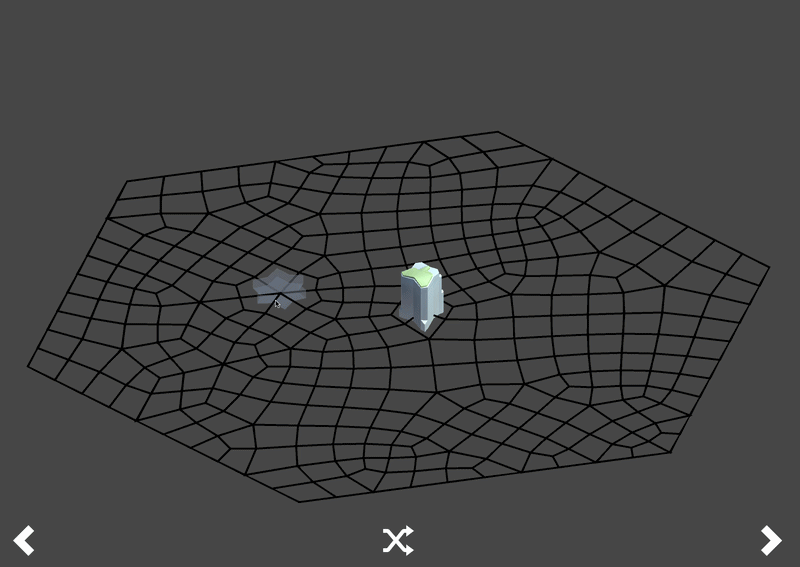

# Procedural Organic Grid Generator

A Unity prototype for generating modular 3D structures on an irregular, organic grid. The project builds its own grid topology at runtime, converts it into a layered 3D representation, selects modular tiles from local corner states, and deforms authored meshes so they conform to non-uniform cells.

## Overview

Regular square grids make modular generation straightforward, but they also produce visibly repetitive layouts. This project explores how modular buildings and terrain transitions can be generated on a grid whose cells vary in shape while remaining usable for tile-based construction.

The system starts from concentric hexagonal rings, triangulates the vertices, merges adjacent triangles into faces, and subdivides the result into four-sided cells. Repeated Laplacian relaxation moves interior vertices toward the average position of their neighbours while preserving the outer boundary, producing the organic layout visible in the demo.

Each 2D cell is then extended across configurable floor levels. Interactive corner states determine which tile configuration belongs in a cell. Selected meshes are rotated, mirrored, combined by material, and fitted to the target cell through lattice deformation.

## Features

- Runtime generation of a connected grid from concentric hexagonal rings
- Triangle merging and face subdivision into a quad-based topology
- Laplacian relaxation for irregular, organic cell placement
- Layered 3D cube representation for multi-floor construction
- Corner-state and bitmask-based module selection
- Wave Function Collapse integration for cell selection
- Land/water tile configurations derived from cell-corner states
- Reuse of tile meshes through rotation and horizontal/vertical reflection
- Material-aware mesh combining that preserves submeshes
- Trilinear lattice deformation for fitting meshes to irregular cells
- Procedurally generated ground, side, top, and bottom mesh colliders
- Raycast-driven cursor previews and click-to-place building blocks
- Seeded topology generation for reproducible layouts

## Generation Pipeline

1. **Create vertices** – Generate concentric rings of vertices around a hexagonal boundary.
2. **Triangulate** – Connect neighbouring ring vertices into a shared triangle topology.
3. **Build quad cells** – Randomly merge compatible triangle pairs and subdivide both merged and remaining faces into four-sided subquads.
4. **Relax the grid** – Apply iterative Laplacian smoothing to interior vertices while keeping boundary vertices fixed.
5. **Create vertical layers** – Extend every subquad into cube data for each configured floor.
6. **Select modules** – Track active cube corners and use their states to determine the required modular tile configuration.
7. **Transform and combine** – Rotate or reflect reusable tile meshes and combine geometry by material.
8. **Fit the geometry** – Map normalized mesh coordinates into an eight-point lattice using trilinear interpolation.
9. **Enable interaction** – Generate mesh colliders and cursor geometry for placing blocks on the ground or adjacent block faces.

## Technical Design

### Grid topology

`Grid` owns the core graph-like data model: `Vertex`, `Edge`, `Triangle`, `Quad`, and `SubQuad`. Shared vertex and edge references preserve neighbourhood information throughout triangulation, merging, subdivision, and relaxation.

The outer ring remains fixed during relaxation. Interior vertices move toward the mean position of their connected neighbours, breaking the symmetry of the original construction without losing the grid boundary.

### 3D construction state

Each `SubQuad` is converted into one `Cube` per floor. A cube stores lower and upper `CubeVertex` instances, its edges, centroid, floor, and height. Active cube corners encode local construction state; `Cube.UpdateCubeCornerBitValue()` converts the eight Boolean corner states into a module bitmask.

### Tile selection and reuse

`GridManager` translates the four active states of a subquad into `LAND` and `WATER` corner types. Consecutive corner types are grouped into single-, double-, triple-, full-, or opposite-corner configurations. The system can rotate and reflect source meshes, reducing the number of unique assets that must be authored.

Meshes sharing a material are combined first, followed by a final combination that retains submesh boundaries and material assignments.

### Mesh deformation

`MeshModificationUtils` normalizes every source vertex within its original bounds. It then maps those coordinates into an eight-control-point lattice around the destination subquad. Trilinear interpolation deforms the complete mesh so that a regular source module conforms to an irregular cell.

### Interaction and colliders

`GroundCollider` generates a mesh collider for every grid cell. `BlockModuleCollider` constructs side, top, and bottom collider meshes for placed modules. `Cursor` raycasts against these layers, determines the nearest quarter-cell corner, displays a procedural placement preview, and adds a block on left click.

## Main Scripts

| Script                                                         | Responsibility                                                                              |
| -------------------------------------------------------------- | ------------------------------------------------------------------------------------------- |
| `GridManager.cs`                                               | Coordinates generation, module placement, tile selection, mesh combination, and deformation |
| `Grid.cs`                                                      | Builds, subdivides, relaxes, and queries the grid topology                                  |
| `Vertex.cs`, `Edge.cs`, `Triangle.cs`, `Quad.cs`, `SubQuad.cs` | Represent the connected 2D topology                                                         |
| `Cube.cs`, `CubeVertex.cs`                                     | Represent vertical grid layers and corner activation state                                  |
| `MeshModificationUtils.cs`                                     | Copies, transforms, and lattice-deforms mesh vertices                                       |
| `BlockModuleCollider.cs`                                       | Builds procedural block colliders and cursor faces                                          |
| `GroundCollider.cs`                                            | Creates per-cell ground colliders                                                           |
| `Cursor.cs`                                                    | Handles raycast targeting, placement previews, and mouse input                              |
| `TileType.cs`                                                  | Defines the supported tile categories                                                       |
| `TileMeshTransformationInfo.cs`                                | Describes reusable mesh rotations and reflections                                           |

## Requirements

- Unity `2021.3.38f1` LTS
- A platform supported by that Unity editor version

## Running the Project

1. Clone the repository.
2. Open the repository folder through Unity Hub using Unity `2021.3.38f1`.
3. Allow Unity to restore the packages listed in `Packages/manifest.json`.
4. Open `Assets/Scenes/MainScene`.
5. Enter Play mode.
6. Move the cursor over a valid grid corner and left-click to place a block.

The grid size and vertical extent can be configured on the `GridManager` component through values such as **Ring Count**, **Ring Radius**, **Floor**, and **Height**.

## Current Status

This is an experimental procedural-generation project. Interactive block placement is implemented; right-click removal exists as an intended operation in the code model but is currently disabled in the cursor input handler. The architecture is designed to support additional tile types, module rules, and generation strategies.

## Possible Extensions

- Complete interactive block removal and neighbour regeneration
- Expose the topology seed and relaxation settings in the Inspector
- Add automated tests for topology invariants and tile transformations
- Add editor tooling for validating module compatibility
- Expand the tile catalogue beyond land and water
- Profile and pool runtime meshes and collider objects

## Author

Developed as a portfolio project exploring computer graphics, procedural generation, computational geometry, mesh processing, and interactive tools in Unity and C#.
